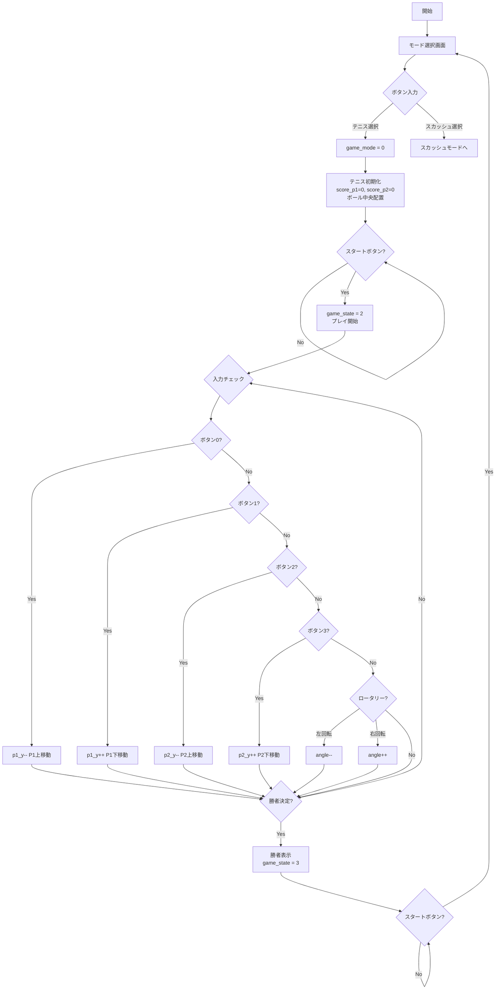
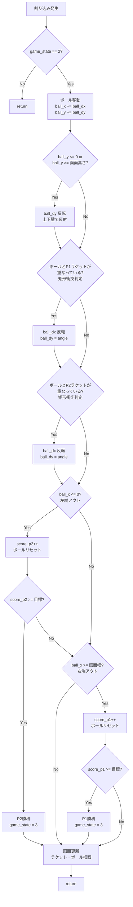
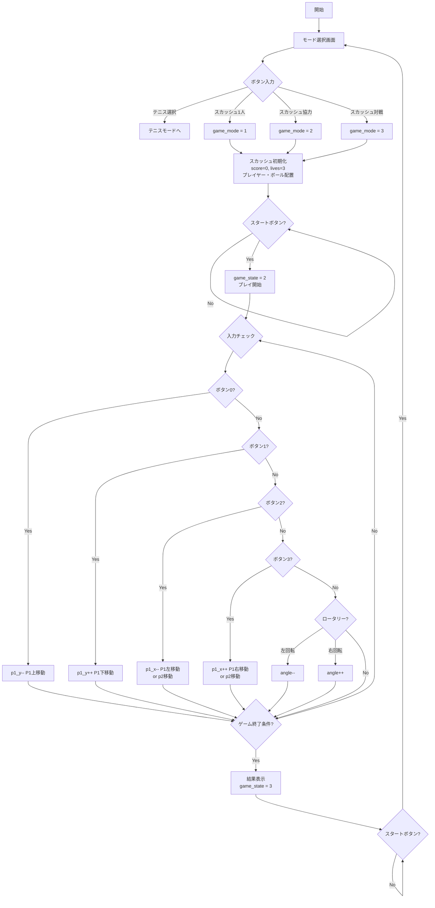
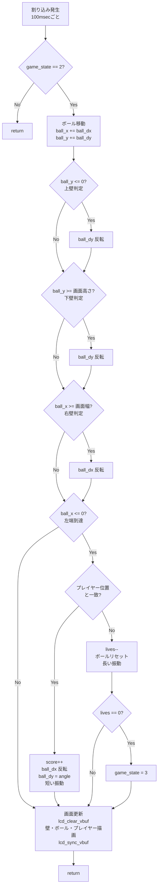
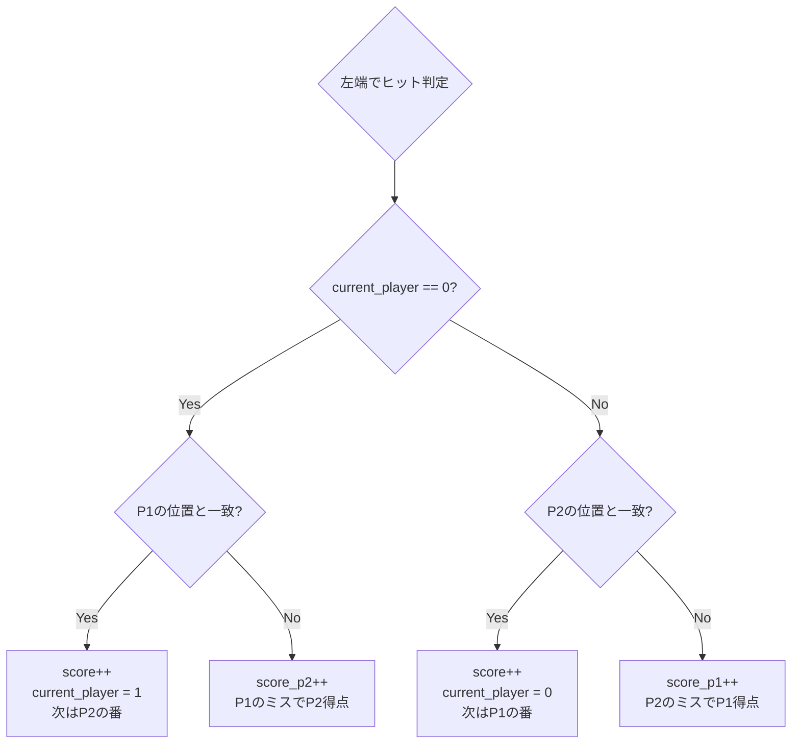
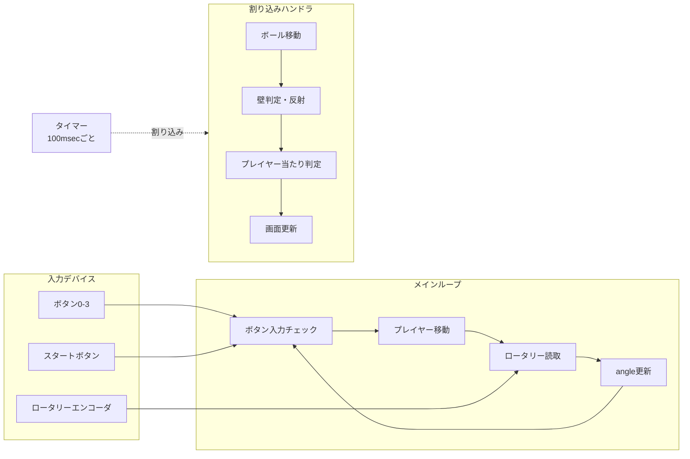

# ゲーム機 仕様書

**班番号:** ___班  
**メンバー:** ___________________________________________  
**ゲーム名:** テニス＆スカッシュゲーム  
**作成日:** 2025年___月___日

---

## ゲームモード選択

本ゲームは2つのモードを搭載：
1. **テニスモード** - 2人対戦でボールを打ち合う
2. **スカッシュモード** - 1人または2人プレイで壁に向かってボールを打ち返す

起動時にモード選択画面を表示し、ボタンでモードを選択する。

---

# テニスモード仕様

## T1. 外部仕様（ユーザ向けの仕様）

### T1.1 ゲーム概要
2人のプレイヤーが左右に分かれ、ボールを打ち合う対戦型テニスゲーム。相手がボールを打ち返せなければ得点。先に一定スコアに達した方が勝利。

### T1.2 操作方法

| 役割 | 操作内容 | 備考 |
|------|----------|------|
| 移動 | 5(上) / 4(下) / 1(左) / 7(右) | 上下左右対応 |
| 角度調整 | ロータリーエンコーダ（左回転 / 右回転） | 跳ね返す方向（ball_dx）を制御 |
| アクション | 0/FPGA上の0, 1 | ゲームの開始およびリスタート |

#### ボタン配置
| ボタン | 方向 |
|--------|------|
| ボタン5 | 上 ↑ |
| ボタン4 | 下 ↓ |
| ボタン1 | 左 ← |
| ボタン7 | 右 → |

#### プレイヤー別操作（テニス2人プレイ時）
| 操作 | プレイヤー1（左側） | プレイヤー2（右側） |
|------|---------------------|---------------------|
| 上移動 | 5 | 6 |
| 下移動 | 4 | B |
| 左移動 | 1 | C |
| 右移動 | 7 | A |
| 角度調整 | ロータリーエンコーダ | ロータリーエンコーダ |

※ 0でゲーム開始 / 
※ リスタートはFPGAボート上の0,1ボタン同時押し

### T1.3 ゲームルール
- 各プレイヤーは上下にのみ移動可能
- ボールが上下の壁に当たると跳ね返る
- ボールがプレイヤーのラケットに当たると跳ね返る
- ロータリーエンコーダでボールの跳ね返り角度を調整可能
- ボールが左端を通過 → プレイヤー2の得点
- ボールが右端を通過 → プレイヤー1の得点
- 先に○点（例: 5点）取った方が勝利

### T1.4 画面表示
```
+----------------------------------+
|                                  |
|  |                          |    |
|  |           *              |    |
|  |                          |    |
|  P1                        P2    |
|                                  |
| スコア: 2 - 3                    |
+----------------------------------+
```
- **プレイヤー1（P1）:** 画面左端に縦棒 `|` で表示
- **プレイヤー2（P2）:** 画面右端に縦棒 `|` で表示
- **ボール:** `*` で表示
- **スコア:** 画面下部

### T1.5 その他の出力
- ボールがラケットに当たったとき: 短いブザー音
- 得点時: 長いブザー音

### T1.6 ゲーム開始・終了条件
- **開始条件:** モード選択後、0を押す
- **終了条件:** どちらかが目標スコアに到達
- **リスタート:** 終了後、FPGA上の0, 1押下でモード選択に戻る

---

## T2. 内部仕様（実装の仕様）

### T2.1 使用する変数（データ構造）

| 変数名 | 型 | 用途 |
|--------|------|------|
| game_mode | int | ゲームモード（0=テニス, 1=スカッシュ） |
| game_state | int | 状態（0=モード選択, 1=待機, 2=プレイ中, 3=終了） |
| score_p1 | int | プレイヤー1のスコア |
| score_p2 | int | プレイヤー2のスコア |
| p1_x | int | プレイヤー1のX座標 |
| p2_x | int | プレイヤー2のX座標 |
| p1_y | int | プレイヤー1のY座標 |
| p2_y | int | プレイヤー2のY座標 |
| ball_x | int | ボールのX座標 |
| ball_y | int | ボールのY座標 |
| ball_dx | int | ボールのX方向速度（-1 or +1） |
| ball_dy | int | ボールのY方向速度（-1, 0, +1） |
| angle | int | ロータリーエンコーダによる角度調整値 |

### T2.2 フローチャート（Mermaid）

#### テニスモード - メインループ




#### テニスモード - 割り込みハンドラ


### T2.3 当たり判定のロジック

#### ラケットとボールの当たり判定
```c
// P1（左側ラケット）の判定
if (ball_x <= P1_X) {
    if (ball_y >= p1_y - RACKET_SIZE && ball_y <= p1_y + RACKET_SIZE) {
        // ヒット！ロータリーエンコーダの角度を適用
        ball_dx = -ball_dx;
        ball_dy = angle;  // ロータリーエンコーダで設定した角度
        // 振動
    } else {
        // ミス → P2得点
        score_p2++;
    }
}
```

---

# スカッシュモード仕様

## S1. 外部仕様（ユーザ向けの仕様）

### S1.1 ゲーム概要
壁に向かってボールを打ち返すスカッシュゲーム。プレイヤーはコート上を二次元的に移動でき、ロータリーエンコーダでボールを打つ角度を調整可能。1人プレイまたは2人協力/対戦プレイに対応。

### S1.2 操作方法

| 役割 | 操作内容 | 備考 |
|------|----------|------|
| 移動 | 5(上) / 4(下) / 1(左) / 7(右) | 上下左右対応 |
| 角度調整 | ロータリーエンコーダ（左回転 / 右回転） | 跳ね返す方向（ball_dx）を制御 |
| アクション | 0/FPGA上の0, 1 | ゲームの開始およびリスタート |

#### ボタン配置
| ボタン | 方向 |
|--------|------|
| ボタン5 | 上 ↑ |
| ボタン4 | 下 ↓ |
| ボタン1 | 左 ← |
| ボタン7 | 右 → |

#### プレイヤー別操作（スカッシュ2人プレイ時）
| 操作 | プレイヤー1（左側） | プレイヤー2（右側） |
|------|---------------------|---------------------|
| 上移動 | 5 | 6 |
| 下移動 | 4 | B |
| 左移動 | 1 | C |
| 右移動 | 7 | A |
| 角度調整 | ロータリーエンコーダ | ロータリーエンコーダ |

※ 0でゲーム開始 / 
※ リスタートはFPGAボート上の0,1ボタン同時押し
※ 2人プレイ時は協力モード（共有残機）または対戦モード（交互プレイ）を選択可能

### S1.3 ゲームルール

#### 共通ルール
- **移動と反射:** プレイヤーは2次元移動可能。ボールは上・下・右の壁で反射する
- **ヒット判定:** ボールが下端に来た際、プレイヤーの位置と重なれば打ち返し成功
- **ミスと終了:** 打ち返せないと残機（lives）が減少。0になるとゲームオーバー
- **スコア:** 打ち返すたびに加算される
- **角度調整:** ロータリーエンコーダで打ち返す角度（ball_dx）を制御

#### 1人プレイモード
- 1人でボールを打ち返し続ける
- ハイスコアを目指す

#### 2人協力モード
- 2人で協力してボールを打ち返す
- 残機は共有
- どちらかが打ち返せればOK

#### 2人対戦モード
- 交互にボールを打ち返す
- ミスしたプレイヤーが失点
- 先に○点取られた方が負け

### S1.4 画面表示
```
+----------------------------------+
|■■■■■■■■■■■■■■■■■■| ← 上壁
|■                              ■|
|■         *                    ■| ← ボール
|■                              ■| ← 右壁
|■     @1        @2             ■| ← プレイヤー1, 2
|                                  | ← 下は開放（左壁なし）
| スコア: 15    残機: ♥♥♥         |
+----------------------------------+
```
- **プレイヤー1:** `@1` または `@` で表示
- **プレイヤー2:** `@2` または `#` で表示（2人プレイ時）
- **ボール:** `*` で表示
- **壁:** 上・下・右の端（下は開放）

### S1.5 LCD表示
- 1人プレイ / 協力モード: 残機数をLCDで表示
- 対戦モード: 各プレイヤーのスコアをLCDで表示

### S1.6 その他の出力
- ボールを打ち返したとき: 短いブザー音
- 得点したとき: 長いブザー音

### S1.7 ゲーム開始・終了条件
- **開始条件:** モード選択後、0を押す
- **終了条件:** 残機が0になる（協力）/ 目標失点に達する（対戦）
- **リスタート:** 終了後、FPGA上の0, 1押下でモード選択に戻る

---

## S2. 内部仕様（実装の仕様）

### S2.1 使用する変数（データ構造）

| 変数名 | 型 | 用途 |
|--------|------|------|
| game_mode | int | ゲームモード（0=テニス, 1=スカッシュ1人, 2=スカッシュ協力, 3=スカッシュ対戦） |
| game_state | int | 状態（0=モード選択, 1=待機, 2=プレイ中, 3=終了） |
| score | int | 現在のスコア（1人/協力モード） |
| score_p1 | int | プレイヤー1のスコア（対戦モード） |
| score_p2 | int | プレイヤー2のスコア（対戦モード） |
| lives | int | 残機数 |
| p1_x | int | プレイヤー1のX座標 |
| p1_y | int | プレイヤー1のY座標 |
| p2_x | int | プレイヤー2のX座標（2人プレイ時） |
| p2_y | int | プレイヤー2のY座標（2人プレイ時） |
| ball_x | int | ボールのX座標 |
| ball_y | int | ボールのY座標 |
| ball_dx | int | ボールのX方向速度（-1, 0, +1） |
| ball_dy | int | ボールのY方向速度（-1 or +1） |
| angle | int | ロータリーエンコーダによる打ち返し角度（-2〜+2など） |
| current_player | int | 現在の打者（対戦モード: 0=P1, 1=P2） |

### S2.2 フローチャート（Mermaid）

#### スカッシュモード - メインループ



#### スカッシュモード - 割り込みハンドラ



#### 2人対戦モード - 追加フロー



### S2.3 当たり判定のロジック

#### ボールとプレイヤーの当たり判定（1人/協力モード）
```c
// 左端到達時
if (ball_x <= 0) {
    int hit = 0;
    
    // プレイヤー1との判定
    if (abs(ball_y - p1_y) <= HIT_RANGE) {
        hit = 1;
    }
    
    // プレイヤー2との判定（2人プレイ時）
    if (game_mode >= 2 && abs(ball_y - p2_y) <= HIT_RANGE) {
        hit = 1;
    }
    
    if (hit) {
        // ヒット！
        score++;
        ball_dx = -ball_dx;
        ball_dy = angle;  // ロータリーエンコーダで設定した角度
        // 振動
    } else {
        // ミス
        lives--;
        ball_x = SCREEN_WIDTH / 2;
        ball_y = SCREEN_HEIGHT / 2;
    }
}
```

#### ボールとプレイヤーの当たり判定（対戦モード）
```c
// 左端到達時（対戦モード）
if (ball_x <= 0) {
    int hit = 0;
    
    if (current_player == 0) {
        // P1の番
        if (abs(ball_y - p1_y) <= HIT_RANGE) {
            hit = 1;
            current_player = 1;  // 次はP2
        } else {
            score_p2++;  // P1ミス → P2得点
        }
    } else {
        // P2の番
        if (abs(ball_y - p2_y) <= HIT_RANGE) {
            hit = 1;
            current_player = 0;  // 次はP1
        } else {
            score_p1++;  // P2ミス → P1得点
        }
    }
    
    if (hit) {
        score++;
        ball_dx = -ball_dx;
        ball_dy = angle;
    } else {
        // ボールリセット
        ball_x = SCREEN_WIDTH / 2;
        ball_y = SCREEN_HEIGHT / 2;
    }
}
```

---

# 共通仕様

## S3. 全体構造（並列処理の概念図）


---

## S4. 備考・その他

### ロータリーエンコーダの実装

```c
// ロータリーエンコーダ読み取り
int read_rotary() {
    static int last_state = 0;
    int current_state = /* ロータリーエンコーダの状態読み取り */;
    
    if (current_state != last_state) {
        if (/* 左回転検出 */) {
            angle--;
            if (angle < -2) angle = -2;  // 最小値制限
        } else if (/* 右回転検出 */) {
            angle++;
            if (angle > 2) angle = 2;    // 最大値制限
        }
        last_state = current_state;
    }
    return angle;
}
```

---

## S5. 質問への回答

### OSもスレッドライブラリもないシステムで同時処理を実現する方法

割り込みハンドラとメインループを組み合わせることで実現する。

- **割り込みハンドラ:** 一定時間ごと（100msec）に自動的に呼ばれる。ボールの移動や画面更新など、時間経過に応じた処理を担当。
- **メインループ:** 常にボタン入力とロータリーエンコーダをチェックし続ける無限ループ。プレイヤーの移動や角度変更など、ユーザー入力に応じた処理を担当。

これにより、「ボールが自動で動きながら、同時にプレイヤーの入力を受け付ける」という同時処理を実現できる。
