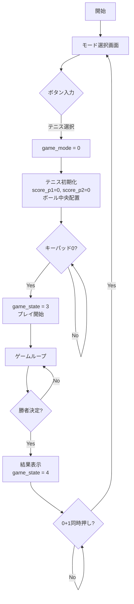
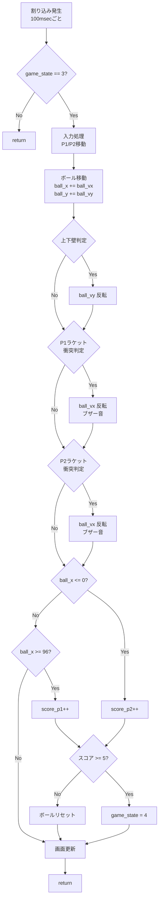
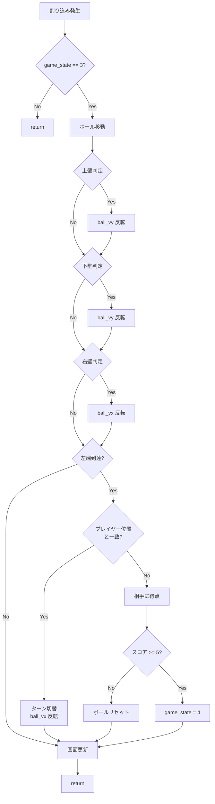
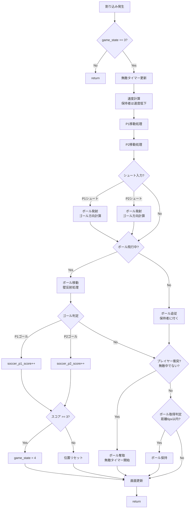
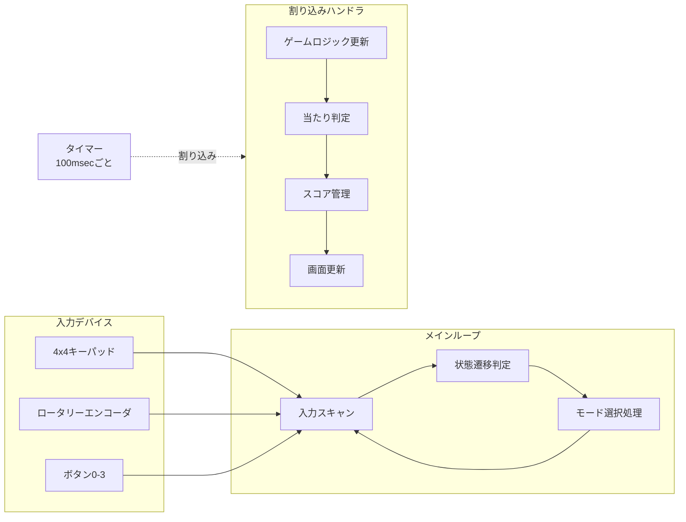

# ゲーム機 仕様書

**班番号:** ___班
**メンバー:** ___________________________________________
**ゲーム名:** マルチゲーム（テニス・スカッシュ・サッカー）
**作成日:** 2025年___月___日

---

## ゲームモード選択

本ゲームは3つのモードを搭載：
1. **テニスモード** - 2人対戦でボールを打ち合う
2. **スカッシュモード** - 2人対戦で壁に向かってボールを打ち返す
3. **サッカーモード** - 2人対戦でゴールを狙う

起動時にモード選択画面を表示し、ロータリーエンコーダまたはボタンでモードを選択する。

---

# テニスモード仕様

## T1. 外部仕様（ユーザ向けの仕様）

### T1.1 ゲーム概要
2人のプレイヤーが左右に分かれ、ラケットでボールを打ち合う対戦型テニスゲーム。相手がボールを打ち返せなければ得点。先に5点に達した方が勝利。

### T1.2 操作方法

#### プレイヤー別操作
| 操作 | プレイヤー1（左側） | プレイヤー2（右側） |
|------|---------------------|---------------------|
| 上移動 | キーパッド 1 | キーパッド A |
| 下移動 | キーパッド 7 | キーパッド C |
| 左移動 | キーパッド 4 | キーパッド 6 |
| 右移動 | キーパッド 5 | キーパッド B |

#### 共通操作
| 操作 | ボタン |
|------|--------|
| ゲーム開始 | キーパッド 0 |
| リスタート | FPGA上のボタン0+1同時押し |

### T1.3 ゲームルール
- 各プレイヤーは2次元移動可能（P1は左半分、P2は右半分）
- ボールが上下の壁に当たると跳ね返る
- ボールがプレイヤーのラケットに当たると跳ね返る
- ボールが左端を通過 → プレイヤー2の得点
- ボールが右端を通過 → プレイヤー1の得点
- 先に5点取った方が勝利

### T1.4 画面表示
```
+----------------------------------+
|                                  |
|  [ラケット]       *      [ラケット] |
|     P1                    P2     |
|                                  |
| スコア: 2 - 3                    |
+----------------------------------+
```
- **プレイヤー1（P1）:** ラケット型スプライト（8x12px）で表示
- **プレイヤー2（P2）:** ラケット型スプライト（8x12px）で表示
- **ボール:** 4x4pxの赤色で表示
- **スコア:** 画面下部に表示

### T1.5 その他の出力
- ボールがラケットに当たったとき: 短いブザー音（G音）
- 得点時: 長いブザー音（高C音）

### T1.6 ゲーム開始・終了条件
- **開始条件:** モード選択後、キーパッド0を押す
- **終了条件:** どちらかが5点に到達
- **リスタート:** 終了後、FPGA上のボタン0+1同時押しでモード選択に戻る

---

## T2. 内部仕様（実装の仕様）

### T2.1 使用する変数（データ構造）

| 変数名 | 型 | 用途 |
|--------|------|------|
| game_mode | int | ゲームモード（0=テニス, 1=スカッシュ, 2=サッカー） |
| game_state | int | 状態（0=初期化, 1=モード選択, 2=待機, 3=プレイ中, 4=結果） |
| score_p1 | int | プレイヤー1のスコア |
| score_p2 | int | プレイヤー2のスコア |
| p1_x | int | プレイヤー1のX座標 |
| p1_y | int | プレイヤー1のY座標 |
| p2_x | int | プレイヤー2のX座標 |
| p2_y | int | プレイヤー2のY座標 |
| ball_x | int | ボールのX座標 |
| ball_y | int | ボールのY座標 |
| ball_vx | int | ボールのX方向速度 |
| ball_vy | int | ボールのY方向速度 |

### T2.2 定数

| 定数名 | 値 | 用途 |
|--------|------|------|
| RACKET_WIDTH | 8 | ラケット幅 |
| RACKET_HEIGHT | 12 | ラケット高さ |
| BALL_SIZE | 4 | ボールサイズ |
| P1_X | 2 | P1初期X座標 |
| P2_X | 86 | P2初期X座標 |
| WINNING_SCORE | 5 | 勝利スコア |

### T2.3 フローチャート（Mermaid）

#### テニスモード - メインフロー



#### テニスモード - 割り込みハンドラ



### T2.4 当たり判定のロジック

```c
// ラケットとボールの当たり判定（矩形衝突）
int check_racket_hit(int racket_x, int racket_y, int ball_x, int ball_y) {
    if (ball_x >= racket_x && ball_x <= racket_x + RACKET_WIDTH &&
        ball_y >= racket_y && ball_y <= racket_y + RACKET_HEIGHT) {
        return 1; // ヒット
    }
    return 0;
}
```

---

# スカッシュモード仕様

## S1. 外部仕様（ユーザ向けの仕様）

### S1.1 ゲーム概要
2人対戦のスカッシュゲーム。プレイヤー1とプレイヤー2が交互にボールを打ち返す。打ち返せなかった方がポイントを失う。先に5点取った方が勝利。

### S1.2 操作方法

#### プレイヤー別操作
| 操作 | プレイヤー1 | プレイヤー2 |
|------|-------------|-------------|
| 上移動 | キーパッド 1 | キーパッド A |
| 下移動 | キーパッド 7 | キーパッド C |
| 左移動 | キーパッド 4 | キーパッド 6 |
| 右移動 | キーパッド 5 | キーパッド B |

#### 共通操作
| 操作 | ボタン |
|------|--------|
| ゲーム開始 | キーパッド 0 |
| リスタート | FPGA上のボタン0+1同時押し |

### S1.3 ゲームルール
- プレイヤー1は画面左上、プレイヤー2は画面左下に配置
- ボールは上・下・右の壁で反射する
- ボールが左端に来た際、担当プレイヤーのラケットで打ち返す
- 打ち返せないと相手のポイント
- 先に5点取った方が勝利

### S1.4 画面表示
```
+----------------------------------+
|■■■■■■■■■■■■■■■■■■| ← 上壁
|■                              ■|
|■  @P1      *                  ■| ← ボール
|■                              ■| ← 右壁
|■  @P2                         ■|
|■■■■■■■■■■■■■■■■■■| ← 下壁
| P1: 2    P2: 3                  |
+----------------------------------+
```
- **プレイヤー1:** 緑色のプレイヤースプライト（8x8px）
- **プレイヤー2:** オレンジ色のプレイヤースプライト（8x8px）
- **ボール:** 4x4pxの赤色
- **壁:** 上・下・右に配置

### S1.5 その他の出力
- ボールを打ち返したとき: 短いブザー音
- 得点時: 長いブザー音

### S1.6 ゲーム開始・終了条件
- **開始条件:** モード選択後、キーパッド0を押す
- **終了条件:** どちらかが5点に到達
- **リスタート:** 終了後、FPGA上のボタン0+1同時押しでモード選択に戻る

---

## S2. 内部仕様（実装の仕様）

### S2.1 使用する変数（データ構造）

| 変数名 | 型 | 用途 |
|--------|------|------|
| sq_p1_x, sq_p1_y | int | プレイヤー1の座標 |
| sq_p2_x, sq_p2_y | int | プレイヤー2の座標 |
| sq_ball_x, sq_ball_y | int | ボールの座標 |
| sq_ball_vx, sq_ball_vy | int | ボールの速度 |
| sq_p1_score | int | プレイヤー1のスコア |
| sq_p2_score | int | プレイヤー2のスコア |
| sq_turn | int | 現在のターン (0=P1, 1=P2) |
| sq_rally | int | ラリー回数 |

### S2.2 定数

| 定数名 | 値 | 用途 |
|--------|------|------|
| WALL_THICKNESS | 4 | 壁の厚さ |
| PLAYER_SIZE | 8 | プレイヤーサイズ |
| PLAYER_SPEED | 4 | 移動速度 |
| HIT_RANGE | 10 | 当たり判定範囲 |
| WINNING_SCORE | 5 | 勝利スコア |

### S2.3 フローチャート（Mermaid）

#### スカッシュモード - 割り込みハンドラ



---

# サッカーモード仕様

## SC1. 外部仕様（ユーザ向けの仕様）

### SC1.1 ゲーム概要
2人対戦のサッカーゲーム。プレイヤーはボールを保持して移動し、シュートで相手ゴールを狙う。先に3点取った方が勝利。

### SC1.2 操作方法

#### プレイヤー別操作
| 操作 | プレイヤー1（左側） | プレイヤー2（右側） |
|------|---------------------|---------------------|
| 上移動 | キーパッド 1 | キーパッド A |
| 下移動 | キーパッド 7 | キーパッド C |
| 左移動 | キーパッド 4 | キーパッド 6 |
| 右移動 | キーパッド 5 | キーパッド B |
| シュート | キーパッド 8 | キーパッド 3 |

#### 共通操作
| 操作 | ボタン |
|------|--------|
| ゲーム開始 | キーパッド 0 |
| リスタート | FPGA上のボタン0+1同時押し |

### SC1.3 ゲームルール

#### 基本ルール
- P1のゴール: 画面右端（x >= 96）
- P2のゴール: 画面左端（x <= 0）
- ボールを保持した状態でシュートを打てる
- 相手ゴールにボールが入ると得点
- 先に3点取った方が勝利

#### ボール保持システム
- ボールに近づく（距離6px以内）とボールを保持できる
- ボール保持中は移動速度が低下（6→4）
- 相手プレイヤーに接触するとボールを奪われる
- ボールを奪われた直後は10フレーム（約1秒）の無敵時間がある

#### シュートシステム
- ボール保持中にシュートボタンでボールを蹴る
- シュートはゴール中心（y=28）に向かって飛ぶ
- シュート方向はプレイヤーとゴールの位置関係で自動調整

### SC1.4 画面表示
```
+----------------------------------+
|  緑色のサッカーフィールド          |
|                                  |
|  [P1]        *        [P2]       |
|  緑色       ボール    オレンジ    |
|                                  |
| ゴールエリア        ゴールエリア   |
| P1: 1    P2: 2                   |
+----------------------------------+
```
- **プレイヤー1:** 緑色のプレイヤースプライト（8x8px）
- **プレイヤー2:** オレンジ色のプレイヤースプライト（8x8px）
- **ボール:** 4x4pxの白色
- **フィールド:** 緑色の背景にフィールドライン
- **ゴールエリア:** 左右端に表示

### SC1.5 その他の出力
- シュート時: 短いブザー音
- ゴール時: 長いブザー音

### SC1.6 ゲーム開始・終了条件
- **開始条件:** モード選択後、キーパッド0を押す
- **終了条件:** どちらかが3点に到達
- **リスタート:** 終了後、FPGA上のボタン0+1同時押しでモード選択に戻る

---

## SC2. 内部仕様（実装の仕様）

### SC2.1 使用する変数（データ構造）

| 変数名 | 型 | 用途 |
|--------|------|------|
| soccer_p1_x, soccer_p1_y | int | プレイヤー1の座標 |
| soccer_p2_x, soccer_p2_y | int | プレイヤー2の座標 |
| soccer_ball_x, soccer_ball_y | int | ボールの座標 |
| soccer_ball_vx, soccer_ball_vy | int | ボールの速度 |
| soccer_ball_flying | int | ボール飛行中フラグ |
| soccer_ball_owner | int | ボール所有者（0=なし, 1=P1, 2=P2） |
| soccer_p1_score | int | プレイヤー1のスコア |
| soccer_p2_score | int | プレイヤー2のスコア |
| soccer_invincible_timer | int | 無敵時間カウンタ |

### SC2.2 定数

| 定数名 | 値 | 用途 |
|--------|------|------|
| SOCCER_NORMAL_SPEED | 6 | 通常移動速度 |
| SOCCER_HOLDER_SPEED | 4 | ボール保持時移動速度 |
| SOCCER_COLLISION_THRESHOLD | 6 | 衝突判定距離 |
| SOCCER_INVINCIBLE_DURATION | 10 | 無敵時間（フレーム数） |
| SOCCER_WINNING_SCORE | 3 | 勝利得点 |
| SOCCER_FIELD_BOTTOM | 48 | フィールド下端Y座標 |

### SC2.3 フローチャート（Mermaid）

#### サッカーモード - 割り込みハンドラ



### SC2.4 シュート方向計算ロジック

```c
// P1シュート処理（右方向のゴールへ）
if (input_p1_dir == 8 && soccer_ball_owner == OWNER_P1) {
    soccer_ball_flying = 1;
    soccer_ball_owner = NO_OWNER;
    soccer_ball_x = soccer_p1_x + PLAYER_SIZE;
    soccer_ball_y = soccer_p1_y + (PLAYER_SIZE - BALL_SIZE) / 2;

    // ゴール中心に向かう方向を計算
    int goal_y = 28; // ゴール中心Y座標
    int dy = goal_y - soccer_ball_y;
    soccer_ball_vx = 8; // 右方向に飛ぶ

    // Y方向速度: 距離に応じて調整
    if (dy > 20) soccer_ball_vy = 3;
    else if (dy > 8) soccer_ball_vy = 2;
    else if (dy > 0) soccer_ball_vy = 1;
    else if (dy > -8) soccer_ball_vy = 0;
    else if (dy > -20) soccer_ball_vy = -2;
    else soccer_ball_vy = -3;
}
```

---

# 共通仕様

## C1. 全体構造（並列処理の概念図）



## C2. ゲームステート定義

| ステート | 値 | 説明 |
|----------|-----|------|
| STATE_INIT | 0 | 初期化 |
| STATE_SELECT | 1 | モード選択画面 |
| STATE_WAIT | 2 | 待機画面（スタート待ち） |
| STATE_PLAY | 3 | プレイ中 |
| STATE_RESULT | 4 | 結果画面 |

## C3. ハードウェアインターフェース

### メモリマップ
| アドレス | 用途 |
|----------|------|
| 0x0000 - 0xfeff | メインメモリ（MIPS コード/データ） |
| 0xff04 | スイッチ/ボタン入力（4ビット） |
| 0xff08 | LED出力（4ビット） |
| 0xff0c | LCD SPI制御（10ビット） |
| 0xff10 | ロータリーエンコーダ1（10ビットカウンタ） |
| 0xff14 | ブザーモード出力（8ビット） |
| 0xff18 | キーパッドマトリクスI/O（4ビット入出力） |
| 0xff1c | ロータリーエンコーダ2（10ビットカウンタ） |

### ハードウェア構成
- **CPU:** パイプラインMIPSプロセッサ（62.5MHz）
- **ディスプレイ:** 96x64 OLED LCD（SPI接続）
- **入力:** 4x4マトリクスキーパッド、ロータリーエンコーダ×2、ボタン×4
- **出力:** LED×4、ブザー（13音階対応）
- **割り込み:** 100msタイマー割り込み

## C4. スプライトパターン

### プレイヤースプライト（8x8px）
```
  ████
 ██  ██
  ████
████████
  ████
 ██  ██
 ██  ██
 █    █
```

### ラケットスプライト（8x12px）
```
  ████
 ██████
 ██████
 ██████
 ██████
  ████
   ██
   ██
   ██
   ██
   ██
   ██
```

---

## C5. ブザー音階

| モード値 | 音階 | 用途 |
|----------|------|------|
| 8 | G | 打ち返し音 |
| 13 | 高C | 得点音/シュート音 |

---

## C6. 質問への回答

### OSもスレッドライブラリもないシステムで同時処理を実現する方法

割り込みハンドラとメインループを組み合わせることで実現する。

- **割り込みハンドラ:** 一定時間ごと（100msec）に自動的に呼ばれる。ボールの移動、当たり判定、画面更新など、時間経過に応じた処理を担当。
- **メインループ:** 常にキーパッド入力とボタン入力をチェックし続ける無限ループ。モード選択やゲーム開始判定など、ユーザー入力に応じた処理を担当。

これにより、「ゲームが自動で進行しながら、同時にプレイヤーの入力を受け付ける」という同時処理を実現できる。
